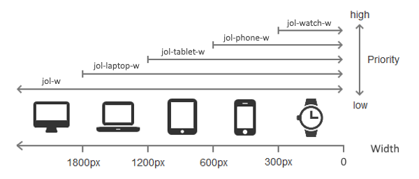

# jol
A simple responsive css library

# Usage
```html
<!-- Responsive Width -->
<div class="jol">
	<div class="jol-6 jol-phone-12">A</div>
	<div class="jol-6 jol-phone-12">B</div>
</div>

<!-- Responsive Visibility with Gap -->
<div class="jol-gap">
	<div class="jol-6 jol-phone-12">A</div>
	<div class="jol-6 jol-phone-hide">apple</div>
	<div class="jol-6 jol-phone-12">B</div>
	<div class="jol-6 jol-phone-hide">boy</div>
</div>
```

# Content

Includes responsive:

- width
- gap
- visibility

Limitations:

- Mixing with fixed widths and percent widths is not supported. Use flex instead!

Attentions:

- Do not apply `padding` to the container and `margin` to the columns.

# Docs

## Containers (Rows):

``` css
.jol /* no gap */
.jol-gap /* with gap */
.jol-gap-2x /* doubled gap */
```

## Columns:

```css
.jol-3 /* a quarter width by default (12 based) */
.jol-tablet-1-2 /* but halt width on tablet (2 based) */
.jol-phone-12 /* and full width on phone */
.jol-watch-hide /* then hide on watch */
```

## Device Widths



```
desktop: default
laptop: < 1800px
tablet: < 1200px
phone: < 600px
watch: < 300px
```

## Width bases

- 12 (default)
- 6
- 5
- 4
- 3
- 2
- 1

## Visibility

- show
- hide

# License

MIT
